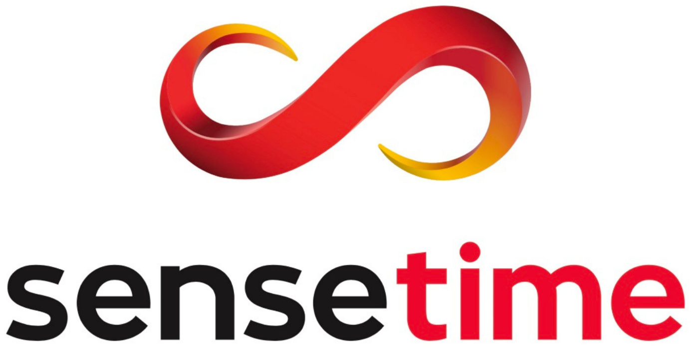

## Hi there 👋

I am a fourth-year direct PhD student in the Department of Computer Science and Technology at Peking University (expected graduation in 2026). Before that, I obtained my undergraduate degree from the School of Electronics and Information Engineering at South China University of Technology in 2021.

### 📌 Research Interests

My research primarily focuses on the field of "Multimodal Large Language Models and Image/Video Understanding", specifically including:

* Multimodal Large Language Model (video understanding), including:
    * General video understanding: Qwen2.5-VL core contributor
    * Audio-visual understanding: VideoLLaMA2; CMM
    * Streaming video understanding: VideoLLaMA3
    * Long video understanding: Inf-CL (CVPR 2025 Highlight)
    * Fine-grained video understanding: VideoRefer (CVPR 2025)
* Image/video segmentation, including:
    * Weakly supervised segmentation: OCR (CVPR 2023)
    * Video instance segmentation: TAR (ICCV 2025)
    * Multimodal segmentation: WiCo (IJCAI 2023, Neurocomputing 2024); PVD (AAAI 2024); BriVIS (AAAI 2025)
    * Medical image segmentation: Fused U-Net (Medical Physics 2021)

### 📈 Academic Achievements

I have published over 20 papers, with a total of  citations on Google Scholar.

The open-source projects I have participated in have received widespread attention, with the number of GitHub Stars for representative projects as follows:

    

### 💬 Contact Information

If you are interested in my research, please feel free to contact me for collaboration or to discuss internship/full-time opportunities 🙏🙏. My email address is: cyanlaser@stu.pku.edu.cn

### 📎 Homepages
- Personal Pages: https://clownrat6.github.io (updated recently🔥)
- Google Scholar: https://scholar.google.com/citations?user=Jkkp8JAAAAAJ

### 🔥 News
<!-- - *2024.03*: 🎉 Two papers are accepted by ICLR 2024 -->
<!-- - *2023.05*: 🎉 Five papers are accepted by ACL 2023 -->
<!-- - *2023.01*: DiffSinger was introduced in [a very popular video](https://www.bilibili.com/video/BV1uM411t7ZJ) (2000k+ views) in Bilibili! -->
<!-- - *2023.01*: I join TikTok  as a speech research scientist in Singapore! -->
- *2021.03*: I join Sensetime  as a research intern in shenzhen for developing [MMSegmentation](https://github.com/open-mmlab/mmsegmentation)  toolkit.

### 💻 Selected Research Papers

My full paper list is shown at [my personal homepage](https://clownrat6.github.io).

<!-- #### 🎙 Audio and Speech Processing
- ``ICLR 2021`` [FastSpeech 2: Fast and High-Quality End-to-End Text to Speech](https://arxiv.org/abs/2006.04558), **Yi Ren**, Chenxu Hu, Xu Tan, et al.
- ``NeurIPS 2019`` [FastSpeech: Fast, Robust and Controllable Text to Speech](https://papers.nips.cc/paper/8580-fastspeech-fast-robust-and-controllable-text-to-speech.pdf), **Yi Ren**, Yangjun Ruan, Xu Tan, et al.
- `ICLR 2024` [Mega-TTS 2: Boosting Prompting Mechanisms for Zero-Shot Speech Synthesis](https://openreview.net/forum?id=mvMI3N4AvD), Ziyue Jiang, Jinglin Liu, **Yi Ren**, et al. 
- ``AAAI 2022`` [DiffSinger: Singing Voice Synthesis via Shallow Diffusion Mechanism](https://arxiv.org/abs/2105.02446), Jinglin Liu, Chengxi Li, **Yi Ren**, et al. [**Project**](https://diffsinger.github.io/) \|  \|  \| 
- ``NeurIPS 2021`` [PortaSpeech: Portable and High-Quality Generative Text-to-Speech](https://arxiv.org/abs/2109.15166), **Yi Ren**, Jinglin Liu, Zhou Zhao, [**Project**](https://portaspeech.github.io/) \|  \| 
- ``ICML 2023`` [Make-An-Audio: Text-To-Audio Generation with Prompt-Enhanced Diffusion Models](https://text-to-audio.github.io/paper.pdf), Rongjie Huang, Jiawei Huang, Dongchao Yang, **Yi Ren**, et al.
- ``ICLR 2023`` [Bag of Tricks for Unsupervised Text-to-Speech](https://openreview.net/forum?id=SbR9mpTuBn), **Yi Ren**, Chen Zhang, Shuicheng Yan
- ``ACL 2022`` [Learning the Beauty in Songs: Neural Singing Voice Beautifier](https://arxiv.org/abs/2202.13277), Jinglin Liu, Chengxi Li, **Yi Ren**, Zhiying Zhu, Zhou Zhao \| 
- ``NeurIPS 2022`` [Dict-TTS: Learning to Pronounce with Prior Dictionary Knowledge for Text-to-Speech](), Ziyue Jiang, Zhe Su, Zhou Zhao, Qian Yang, **Yi Ren**, et al. 

#### 👄 Talkingface Generation
- ``ICLR 2024`` [Real3D-Portrait: One-shot Realistic 3D Talking Portrait Synthesis](https://openreview.net/forum?id=7ERQPyR2eb), Zhenhui Ye, Tianyun Zhong, **Yi Ren**, et al.
- ``ICLR 2023`` [GeneFace: Generalized and High-Fidelity Audio-Driven 3D Talking Face Synthesis](https://openreview.net/forum?id=YfwMIDhPccD), Zhenhui Ye, Ziyue Jiang`, **Yi Ren**, et al.

#### 📚 Machine Translation 
- ``ACL 2023`` [AV-TranSpeech: Audio-Visual Robust Speech-to-Speech Translation](), Rongjie Huang, Huadai Liu, Xize Cheng, **Yi Ren**, et al.
- ``ICLR 2023`` [TranSpeech: Speech-to-Speech Translation With Bilateral Perturbation](https://openreview.net/forum?id=UVAmFAtC5ye), Rongjie Huang, Jinglin Liu, Huadai Liu, **Yi Ren**, et al.
- ``ACL 2020`` [SimulSpeech: End-to-End Simultaneous Speech to Text Translation](https://www.aclweb.org/anthology/2020.acl-main.350), **Yi Ren**, et al.
- ``ICLR 2019`` [Multilingual Neural Machine Translation with Knowledge Distillation](https://openreview.net/forum?id=S1gUsoR9YX), Xu Tan, **Yi Ren**, et al.

#### 🎼 Music Generation 
- ``ACM-MM 2020`` [PopMAG: Pop Music Accompaniment Generation](https://dl.acm.org/doi/10.1145/3394171.3413721), **Yi Ren**, Jinzheng He, Xu Tan, et al.

#### 🧑‍🎨 Generative Model
- ``ICLR 2022`` [Pseudo Numerical Methods for Diffusion Models on Manifolds](https://openreview.net/forum?id=PlKWVd2yBkY), Luping Liu, **Yi Ren**, et al. \|  \| 
 -->